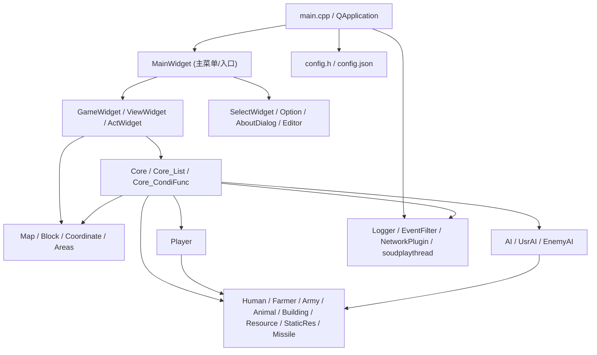

## newAOE —— Qt 实时战略游戏

基于 **Qt 5.9.2** 和 C++14 开发的 2D 实时战略（RTS）游戏，玩法类似《帝国时代》，包含：

- **即时战略对战**：资源采集、建造建筑、训练军队、对战敌人  
- **AI 对战**：支持玩家 AI、敌方 AI，提供独立的 AI 接口文档  
- **地图编辑器**：内置地图编辑功能，支持保存与加载自定义地图  
- **考试 / 接口模式**：通过命令行参数与 HTTP 接口配合外部评测系统  

本项目为 **2023 年南京理工大学科研训练项目**。

> 架构师入口：从 [项目架构导航树](docs/architecture/README.md) 开始，可按功能模块跳转到实现说明和对应源码。

---

## 项目介绍

- **项目名称**：newAOE（Age of Empires）  
- **版本信息**：在 `config.json` 中定义，例如 `GAME_VERSION: "v2.51c"`  
- **主要特性**：  
  - 多文明/多单位的即时战略对战  
  - 包含农民、军队、动物、资源、建筑等多种对象  
  - 支持 AI 脚本控制，提供详细的状态与操作接口（见 `AI接口使用指南.md`）  
  - 提供地图编辑器与基础网络插件 `NetworkPlugin`  

### 文档索引（所有 Markdown 文档及用途）

| 文档 | 用途说明 |
|------|----------|
| `README.md` | 本文件：项目概览、安装构建、文件说明、架构与使用说明。 |
| `AI接口使用指南.md` | 游戏状态结构体（tagInfo、tagFarmer、tagArmy、tagBuilding、tagResource 等）、getInfo()、指令返回值 ins_ret、示例代码；AI 编写必读。 |
| `游戏编程玩法.md` | **仅用封装函数**的玩法代码：HumanMove、HumanBuild、HumanAction、BuildingAction、PinPointStrike；村民建造/采集、建筑操作、各兵种攻击与投石车定点投射的具体代码与示例。 |
| `村民建造操作清单.md` | 村民可造建筑一览（时代、前置、木/食/石/金、建造时间）、建造条件与内核实现（conditionDevelop、Player::changeResource 等）、config 键名与代码位置。 |
| `CURSOR_QT_开发指南.md` | 在 Cursor / VS Code 下的 Qt 环境配置、qmake 构建、调试配置与常见问题。 |

---

## 使用的 Qt 版本

- **Qt 版本**：推荐使用 **Qt 5.9.2**  
  - 示例路径：`C:/ProgramData/Qt5.9.2/5.9.2/mingw53_32`  
- **编译器**：MinGW 5.3.0 32-bit（`mingw53_32`）  
- **Qt 模块**（见 `newAOE.pro`）：  
  - `core`、`gui`、`multimedia`  
  - `widgets`（Qt 5 及以上）  
- **C++ 标准**：`CONFIG += c++14`  

如需在其它版本 Qt 下编译，需保证上述模块可用，并根据实际环境调整 `newAOE.pro` 与 Qt 安装路径。

---

## 安装与构建方式（怎么安装）

### 环境要求

- 已安装 **Qt 5.9.2**（带 MinGW 5.3.0 32-bit 工具链）  
- 已安装 `qmake` 与 `mingw32-make`（随 Qt 工具链提供）  
- 推荐工具：Qt Creator 或 Cursor / VS Code

### 方式一：使用 Qt Creator

1. 克隆或下载本仓库到本地：  
   ```bash
   git clone <your-repo-url>
   cd new-aoe
   ```
2. 用 Qt Creator 打开项目根目录下的 `newAOE.pro`。
3. 选择合适的 Qt Kit（Qt 5.9.2 + MinGW 32-bit）。
4. 点击 **Configure Project**，然后 **Build** 项目。
5. **关闭影子构建**：左侧点「项目」→ 在「构建目录」处取消勾选 **Shadow build**（否则可执行文件在影子目录，运行可能异常）。
6. 构建成功后点击 **Run** 即可启动游戏。

### 方式二：使用 Cursor / VS Code（推荐）

1. 在 Cursor 中打开工作区文件：  
   - 菜单 `文件 > 打开工作区`，选择 `newAOE.code-workspace`。  
2. 按照 `CURSOR_QT_开发指南.md` 安装推荐扩展（C/C++、CMake Tools 等）。  
3. 在命令面板 `Ctrl+Shift+P` 中执行：  
   - 运行任务 **`qmake & make`**（Debug 构建），或  
   - 运行任务 **`qmake & make release`**（Release 构建）。  
4. 构建完成后，在调试面板选择对应配置（如 `Qt Debug`），按 **F5** 运行。

### 方式三：命令行构建（qmake + make）

在已配置好 Qt 环境变量的命令行中（可使用随项目提供的 `qt-env.bat`）：

```bash
cd path/to/new-aoe
qmake newAOE.pro
mingw32-make       # 或 make，根据环境而定
```

成功后在生成目录（通常为 `./debug` 或 `./release`）中找到可执行文件 `newAOE.exe` 并运行。

---

## 主要文件与目录说明（各个文件是干什么的）

> 本项目所有 C++ 源码（`.cpp` / `.h`）和 Qt UI 文件（`.ui`）都位于项目根目录，没有单独的 `src/`、`include/` 目录。

**目录与文件概览**

| 类型 | 说明 |
|------|------|
| 根目录 | `*.cpp`、`*.h`、`*.ui` 源码与头文件；`newAOE.pro`、`newAOE.code-workspace`、`config.json`；各 Markdown 文档（见上方文档索引表）。 |
| `res/` | 游戏资源目录（图片、音效等），由 `config.json` 中 `RESPATH` 指定。 |
| `debug/`、`release/` | qmake 构建生成目录，内含 `newAOE.exe` 及依赖；运行前需保证 `config.json`、`res` 等与可执行文件相对路径正确。 |
| 地图文件 | 地图保存/加载使用 `config.json` 中 `MAPFILE_SUFFIX`（如 `njust`）及程序约定的路径与命名（如 `tmpMap.txt`、`gameMap.txt` 等），具体见代码与课程说明。 |

### 工程与配置相关

| 文件 | 作用说明 |
|------|----------|
| `newAOE.pro` | Qt qmake 工程文件：指定目标为应用程序 `newAOE`，引入 Qt 模块（core、gui、widgets、multimedia），启用 C++14，并列出所有源文件、头文件、UI 表单。 |
| `newAOE.code-workspace` | Cursor / VS Code 工作区配置，内含 Qt 5.9.2 的 Kit 路径（如 mingw53_32）及推荐扩展，便于在本机直接构建与调试。 |
| `config.h` | 编译期配置头文件：定义地图块类型、高度常量、行动/攻击类型枚举、单位/建筑种类数量、寻路与投掷相关宏等大量游戏常数；同时包含 Qt、标准库等通用头文件。主要枚举见下表。 |

**config.h 主要枚举与常量索引**

| 类别 | 枚举/常量示例 | 用途 |
|------|----------------|------|
| 建筑类型 | BUILDING_HOME, BUILDING_STOCK, BUILDING_GRANARY, BUILDING_ARMYCAMP, BUILDING_RANGE, BUILDING_STABLE, BUILDING_MARKET, BUILDING_DOCK, BUILDING_SIEGE, BUILDING_COLLAGE, BUILDING_CENTER, BUILDING_FARM, BUILDING_ARROWTOWER 等 | 建筑种类，用于 HumanBuild、BuildingAction 及判断。 |
| 建筑行动 | BuildingAction 枚举：BUILDING_CENTER_CREATEFARMER, BUILDING_STOCK_UPGRADE_*, BUILDING_ARMYCAMP_CREATE_*, BUILDING_RANGE_CREATE_*, BUILDING_STABLE_CREATE_*, BUILDING_DOCK_CREATE_*, BUILDING_SIEGE_CREATE_STONE_THROWER, BUILDING_COLLAGE_CREATE_HOPLITE 等 | 研发/造兵等，用于 BuildingAction(建筑SN, Action)。 |
| 兵种 | AT_ARMY 枚举：AT_CLUBMAN, AT_SLINGER, AT_BOWMAN, AT_SCOUT, AT_SWORDSMAN, AT_CAVALRY, AT_SHIP, AT_STONE_THROWER, AT_PRIEST, AT_HOPLITE, AT_CHARIOT, AT_CHARIOT_ARCHER, AT_BROADSWORDSMAN, AT_COMPOSITE_BOWMAN 等 | 军队种类，用于 getInfo().armies[i].Sort。 |
| 资源类型 | RESOURCE_BUSH, RESOURCE_TREE, RESOURCE_STONE, RESOURCE_GOLD, RESOURCE_GAZELLE, RESOURCE_ELEPHANT, RESOURCE_LION, RESOURCE_FISH | 资源点种类，用于 getInfo().resources[j].Type。 |
| 单位种类 | SORT_FARMER, SORT_ARMY, SORT_BUILDING, SORT_STATICRES, SORT_ANIMAL 等 | 对象大类。 |
| 农民状态 | HUMAN_STATE_IDLE, HUMAN_STATE_WALKING, HUMAN_STATE_WORKING, HUMAN_STATE_ATTACKING | 农民当前状态。 |
| 指令类型 | INS_CANCEL, INS_HUMANMOVE, INS_HUMANACTION, INS_HUMANBUILD, INS_BUILDINGACTION, INS_PINPOINT_STRIKE | 内部指令类型（玩法层用封装函数即可）。 |

| `config.json` | 运行时配置：从文件读取版本、窗口与地图尺寸、帧间隔、玩家数、初始资源、游戏服务器地址、考试/调试开关等，供程序启动时加载。主要配置项见下方「config.json 主要配置项一览」表。 |

### 入口与全局组件

| 文件 | 作用说明 |
|------|----------|
| `main.cpp` | 程序入口：启用 OpenGL（`Qt::AA_UseDesktopOpenGL`），创建 `QApplication`，初始化 `Logger`（日志级别）、`NetworkPlugin`（网络线程）、全局 `EventFilter`，解析命令行（如 `-l`/`-last`、`-s`/`-select`、`--exam`、`--id`、`--api` 等），根据 `mapJudge` 构造并显示 `MainWidget`。 |
| `GlobalVariate.h` / `GlobalVariate.cpp` | 全局变量与游戏常数：声明并定义从 config 解析出的数值（初始资源、碰撞盒、建筑/单位属性、科技树相关常量等）、全局指针（如 `nowobject`、`NetworkManager`、`eventFilter`）、`MouseEvent`、`tagGame`/`tagInfo`、指令队列等，供各模块引用。 |
| `Logger.h` / `Logger.cpp` | 日志系统：基于 Qt 消息处理，将 qDebug/qWarning 等输出重定向到文件；支持按日志级别过滤、按文件名排除（如排除 EnemyAI/UsrAI 的刷屏）、记录启动后的相对时间，便于调试与排查问题。 |
| `EventFilter.h` / `EventFilter.cpp` | 全局事件过滤：`EventFilter` 继承 `QObject`，安装到 `QApplication`，统一接收鼠标（左/右键按下、释放、移动、滚轮）与键盘事件，并分发给注册的 `EventFilterBase` 子对象（如各 Widget、区域选择器），实现“谁获得焦点谁响应”的交互逻辑。 |
| `networkplugin.h` / `networkplugin.cpp` | 网络插件：在独立线程中运行，维护 `QNetworkAccessManager` 与任务队列；提供 `postJson(url, header, json)` 接口，用于向 `config.json` 中的 `GameServerAddr` 上报游戏状态（如考试/评测接口），支持超时与 `waitDone()` 等待发送完成。 |
| `config.json` | 运行时配置：从文件读取版本、窗口与地图尺寸、帧间隔、玩家数、初始资源、游戏服务器地址、考试/调试开关等，供程序启动时加载。主要配置项见下表。 |

**config.json 主要配置项一览**

| 配置项 | 含义说明 |
|--------|----------|
| `GAME_VERSION`、`GAME_TITLE` | 游戏版本号与窗口标题。 |
| `GAME_WIDTH`、`GAME_HEIGHT` | 主窗口宽高（像素）。 |
| `GAMEWIDGET_WIDTH`、`GAMEWIDGET_HEIGHT` | 游戏画布宽高。 |
| `MAP_L`、`MAP_U` | 地图块数（列、行）。 |
| `BLOCKSIDELENGTH` | 每块边长（像素/逻辑单位）。 |
| `TimePerFrame` | 每帧时长（毫秒）。 |
| `FRAMES_PER_SECOND` | 目标帧率。 |
| `NOWPLAYER`、`NOWPLAYERREPRESENT` | 玩家数量与代表方。 |
| `INITIAL_WOOD`、`INITIAL_MEAT`、`INITIAL_STONE`、`INITIAL_GOLD` | 初始资源。 |
| `GameServerAddr` | 考试/评测上报接口地址（如 CodeRunStatusPost）。 |
| `IsExamining` | 是否开启考试模式。 |
| `DataPostIntervalFrame` | 向服务器上报状态的间隔帧数。 |
| `MAP_EXPLORE`、`MAP_VISIABLE` | 是否全图探索、是否全图可见。 |
| `MAPFILE_SUFFIX` | 地图文件后缀（如 `njust`）。 |
| `RESPATH` | 资源文件根目录（如图片、音效）。 |
| `OPTION_MUSIC`、`OPTION_SOUND`、`OPTION_SELECT` 等 | 选项默认值（音乐、音效、选中高亮等）。 |
| `FARMER_*`、`CNT_*`、`BLOOD_*`、`VISION_*` | 单位/资源/建筑相关数值（采集速度、携带上限、血量、视野等），与 config.h 常量对应或覆盖。 |

### 主界面与 UI 相关

| 文件 | 作用说明 |
|------|----------|
| `MainWidget.*` / `MainWidget.ui` | 主窗口：持有 `Map`、`Player[]`、`Core`、`SelectWidget`、`GameWidget`、多个 `ActWidget`、`UsrAI`/`EnemyAI` 等；负责主菜单、开始游戏/选图/设置/关于/编辑器的切换，以及单位引用清理、敌人状态查询等；根据启动参数 `MapJudge` 决定是否加载上次或指定地图。 |
| `GameWidget.*` / `GameWidget.ui` | 游戏画布：负责 `paintEvent` 绘制地图与单位、鼠标/键盘事件、屏幕坐标与地图坐标（DR/UR）互转、状态保存与回滚（SaveCurrentState/RollBackState）；持有 `GameState`（高度图、Block 网格、我方/敌方建筑与单位列表等），是实际“玩游戏”的视图。 |
| `SelectWidget.*` / `SelectWidget.ui` | 选择/操作面板：显示当前选中单位、可用操作按钮（建造、攻击、移动等）、经过时间等；调用 `Core` 执行 `doActs(actName, nowobject)`，并刷新 `ActWidget` 的显示，是玩家与 `Core` 交互的桥梁。 |
| `Option.*` / `Option.ui` | 选项对话框：提供音乐、音效、选择高亮、线条、坐标、重叠等开关（对应 `OPTION_MUSIC` 等），以及与地图块/文本/文件清理、暂停、选图等按钮，设置保存在内存或配置中供全局使用。 |
| `AboutDialog.*` / `AboutDialog.ui` | 关于对话框：展示项目名称、版本等关于信息，带 `paintEvent` 绘制 Logo 或图片（QPixmap）。 |
| `Editor.*` / `Editor.ui` | 地图编辑器：独立窗口，用于编辑地图（地形、单位摆放等），与主游戏流程分离，通过主菜单进入。 |
| `ViewWidget.*` | 视图组件：接收我方/敌方建筑列表、农民列表、静态资源列表、动物列表等指针，在 `paintEvent` 中绘制这些对象，用于在游戏界面中显示单位与资源的小地图或局部视图。 |
| `ActWidget.*` | 单个“行动”按钮控件：显示一个操作的图标（QPixmap）、阶段、状态、编号；点击发出 `actPress(num)` 信号，用于在 SelectWidget 中排布多个可点击操作（建造、训练、攻击等）。 |

### 游戏核心与地图系统

| 文件 | 作用说明 |
|------|----------|
| `Core.*` | 游戏核心：持有 `Map`、`Player[]`、`Core_List`（关系表）、`MouseEvent`；每帧 `gameUpdate()` 驱动逻辑，包括 `updateByObject()` 更新单位、`manageMouseEvent()`/`manageOrder()` 处理鼠标与 AI 指令、`addRelation`/`suspendRelation` 管理“谁对谁做什么”的关系、碰撞与运输判断、`infoShare()` 同步给 AI、`PostDataToServer()` 上报状态；提供 `deleteSelf`、`get_IsObjectFree`、`getPlayerNowResource` 等接口给 UI 与 AI。 |
| `Core_List.*` | 关系表与指令管理：维护 `relate_AllObject`（对象→当前行动目标/阶段）和静态的 `relation_Event_static`（事件类型→阶段链）；实现 `addRelation`（移动、建造、建筑行动、定点打击等）、`suspendRelation`、`eraseRelation`、`manageRelationList()`、寻路相关辅助；判断对象是否空闲、获取当前阶段与目标 SN，供 Core 与 AI 使用。 |
| `Core_CondiFunc.*` | 条件与寻路辅助：定义 `pathNode`/`treeNode` 等寻路数据结构与 A* 相关逻辑、各种地形/可达性判断函数；提供与胜负条件、任务达成、可通行性等相关的条件判断，被 Core/Map 等调用。 |
| `Map.*` | 地图数据与寻路：管理二维 `Block` 网格、地形类型与高度、海岸/斜坡判断；`loadfindPathMap`/`loadBarrierMap` 生成寻路用障碍与视野图；提供 `isBarrier`、`isFlat`、`findBlock_Free`、`CanCrush` 等接口；支持按 MapJudge 初始化、划分地图、获取可保存的地图文件列表等。 |
| `Block.*` | 地图格子：继承 `Coordinate`，表示单格地形；管理静态的 `block[]`/`grayblock[]`/`blackblock[]` 图像资源列表（按地形类型索引），用于绘制草地、水面等；提供分配/释放与 getter/setter。 |
| `Coordinate.*` | 游戏对象基类：所有“可放在地图上的东西”的抽象基类；定义虚函数如 `getSort()`、`nextframe()`、`get_isActionEnd()`、`getVision()`、`setAction()`、`getSound_Click()` 等，用于统一处理显示、所属玩家、行动与音效；子类包括 Block、Human、Building、StaticRes、Missile 等。 |
| `RectArea.*` | 矩形区域选择：继承 `AreaSelected`，用鼠标拖拽定义矩形区域（dr, ur, w, h），支持“原有区域”与“巡逻区域”等类型；维护与单位的对应关系（relation），用于框选、巡逻区等。 |
| `CircleArea.*` | 圆形区域选择：类似 RectArea，但用圆心+半径表示圆形区域，用于圆形范围选择或技能范围。 |
| `LineArea.*` | 线段区域选择：用线段定义区域，用于线型范围或路径类操作。 |
| `AreaSelected.h` | 区域选择基类：继承 `EventFilterBase`，定义 `onLeftMouseDown/Up`、`onMouseMove`、`Draw`、`onRightMouseClick/Down` 等纯虚函数，由 Rect/Circle/Line 区域实现，用于统一处理“拖拽画区域→右键确认”的交互。 |

### 单位、建筑与对象系统

| 文件 | 作用说明 |
|------|----------|
| `Coordinate.*` | 见上“游戏核心与地图系统”。 |
| `MoveObject.*` | 可移动对象基类：继承 `Coordinate`，增加速度、角度、下一格/目的地坐标、路径栈（path）、状态（stand/walk/attack 等）、碰撞对象等；实现基于路径的移动、与地图的碰撞检测，被 Human、Animal、Missile 等继承。 |
| `Bloodhaver.h` / `Bloodhaver.cpp` | 血量与战斗属性：管理最大血量、当前血量、攻击力/防御力、攻击类型（近战/远程）、是否投掷物攻击等；提供 `getATK`、`getDEF`、`getMaxBlood`、`init_Blood` 等，被 Human、Building、Animal、Missile 等需要“可被攻击”的对象继承。 |
| `Human.*` | 人类单位基类：继承 `MoveObject` 与 `BloodHaver`，与 `Development`（科技树）绑定，决定移动速度、血量、攻击力等受科技加成的数值；提供 `getPlayerRepresent`、攻击状态、投掷判定等，是 Farmer、Army 的父类。 |
| `Farmer.*` | 农民单位：继承 Human，负责采集、建造、携带资源等；有站立/行走/工作/攻击等状态与对应图像资源，可被 AI 通过 `HumanMove`、`HumanAction`、`HumanBuild` 等接口控制。 |
| `Army.*` | 军队单位：继承 Human，代表各类兵种（步兵、弓箭手等），具有攻击、防御、移动等战斗逻辑，可由 Player 创建（addArmy/addArmyAROUND/addArmyATTACK 等）并参与战斗与寻路。 |
| `Animal.*` | 动物单位：继承 MoveObject、Resource、BloodHaver，表示地图上的野生动物（可狩猎为肉）；有 Idle/Roaming/Attack 等状态、友好度、视野与速度配置，被击杀后作为资源点被采集。 |
| `StaticRes.*` | 静态资源：继承 Coordinate 与 Resource，表示浆果丛、石头、金矿等固定资源点；有剩余量（Cnt）、可采集性、腐烂率等，农民与之交互进行采集。 |
| `Resource.*` | 资源抽象：定义资源类型（木/肉/石/金）、数量（Cnt）、可采集性、`updateCnt_byGather`/`updateCnt_byDecay`、`get_ReturnBuildingType` 等，被 StaticRes、Building_Resource 继承。 |
| `Building.*` | 建筑基类：继承 Coordinate 与 BloodHaver，管理建筑类型、时代、敌我、血量、视野、建造中/已建成图像资源；提供训练单位、升级、防御等逻辑；静态数组定义各建筑名称、消耗、时间等。 |
| `Building_Resource.*` | 资源类建筑：继承 Building 与 Resource，表示仓库、磨坊等可存放/产出资源的建筑；维护当前持有量与采集者（gatherer），判断是否可由某农民采集（isGathererAsLandlord）。 |
| `Missile.*` | 投射物：继承 MoveObject，表示箭矢、石头等飞行物；由攻击者与目标（或目标坐标）创建，按轨迹飞行并在一帧内判定命中与伤害，命中后销毁并回调攻击者记录。 |

### 玩家与 AI 系统

| 文件 | 作用说明 |
|------|----------|
| `Player.*` | 玩家对象：管理该玩家的建筑列表（build）、人口列表（human）、导弹列表（missile）；提供 addBuilding、addHuman、addFarmer、addArmy、addMissile、removeHuman、deleteHuman/deleteBuilding/deleteMissile 等；维护木材/食物/石头/金子四种资源及 changeResource；持有 Development（科技树），与 Core、Map 配合完成建造、训练、升级等。 |
| `Development.*` | 科技树/时代：按文明时代（如石器/青铜/铁器）管理建筑次数、单位属性加成（移动、血量、攻击、防御、资源采集等）；提供 get_rate_*、get_addition_* 等接口，供 Human、Building 计算最终数值。 |
| `AI.*` | AI 线程基类：继承 QThread，在独立线程中运行；定义 HumanMove、HumanAction、HumanBuild、BuildingAction、PinPointStrike 等对外接口（对应学生/AI 可调用的指令），内部通过 `processData()` 从 getInfo() 取状态并调用 AddToIns 将指令送入队列；子类实现 processData、getInfo、AddToIns、clearInsRet。 |
| `UsrAI.*` | 玩家方 AI：继承 AI，id=0；从全局 `tagUsrGame` 读取游戏状态（getInfo），将指令写入 `UsrIns`；学生可在规定区域内编写 processData 逻辑，实现自动采集、建造、出兵等。 |
| `EnemyAI.*` | 敌方 AI：继承 AI，id=1；从 `tagEnemyGame` 读取状态，指令写入 `EnemyIns`；内部可实现 Around、Attack、assignTargetsBasedOnVision 等策略，与 MainWidget 的 setEnemyStatus/getEnemyStatus 配合用于调试或显示。 |
| 详细 API | 游戏状态结构体（tagUsrGame/tagEnemyGame、tagInfo）、指令格式及返回值说明见 **`AI接口使用指南.md`**。玩法层封装函数与各操作具体代码见 **`游戏编程玩法.md`**。 |

### 其他辅助文件

| 文件 | 作用说明 |
|------|----------|
| `soudplaythread.h` / `soudplaythread.cpp` | 音效播放线程：继承 QThread，维护一个音效路径队列（soundQue），在 run() 中循环取出并播放，避免在主线程播放卡顿；通过 AddSound 将需要播放的音效加入队列。 |
| `PerlinNoise.hpp` | Perlin 噪声：头文件实现的 Perlin 噪声函数，用于地图生成时产生连续的地形高度或随机分布，使地图更自然。 |
| `GameScore.txt` | 示例或默认的比分/记录文件：可能被用于保存对局结果或调试时的分数记录，具体格式以代码使用为准。 |
| `LICENSE` | 项目许可证文本。 |  

---

## 软件架构（采用的是哪种架构）

整体采用 **基于 Qt Widgets 的多窗口 / 多组件架构**，再在其上构建 **游戏核心 + 单位系统 + 玩家 / AI + 辅助系统** 的分层设计。



- `main.cpp` 负责应用初始化与全局单例创建。  
- `MainWidget` 是所有界面的入口，负责在主菜单、游戏界面、编辑器等之间切换。  
- `Core`、`Map`、各类单位 / 建筑等组成游戏运行时的核心逻辑。  
- `Player`、`AI` 在核心之上决策，驱动单位行为。  
- `Logger`、`EventFilter`、`NetworkPlugin`、声音线程等作为横切功能服务于整个系统。  

---

## 使用说明

### 基本运行

构建成功后，直接运行生成的 `newAOE.exe` 即可进入主菜单：  

- **主菜单**：开始游戏、加载地图、选项、关于、地图编辑器等。  
- **游戏中**：左键选中单位或建筑，右侧面板显示可用操作（建造、训练、研发、移动、攻击等）；右键空地移动、右键目标攻击/采集；具体快捷键与鼠标操作以界面提示和课程文档为准。  
- **可执行文件位置**：使用 qmake + make 时，通常在项目根目录下的 `debug/newAOE.exe` 或 `release/newAOE.exe`；运行前请确保 `config.json`、`res` 等资源与可执行文件相对路径正确（或从项目根目录启动）。

### 命令行参数

| 参数 | 含义说明 |
|------|----------|
| `-l` / `-last` | 加载上一次使用的地图（如 `tmpMap.txt`）。 |
| `-s` / `-select` | 加载指定地图文件（如 `gameMap.txt`），具体文件名以代码中 `mapJudge` 逻辑为准。 |
| `--exam` | 考试模式开关，值 `true` 或 `false`。 |
| `--indices` | 本次在数据库中的编号（评测用）。 |
| `--id` | 学号（评测用）。 |
| `--api` | 访问评测服务器的密钥或 API 标识。 |

### 玩法与编程接口速查（封装函数）

玩法层只需使用以下**五个封装函数**（详见 `游戏编程玩法.md`）。

| 玩法 | 封装函数 | 说明 |
|------|----------|------|
| 单位移动 | `HumanMove(SN, DR0, UR0)` | SN 为单位序列号，DR0/UR0 为目标细节坐标。 |
| 村民建造 | `HumanBuild(SN, BuildingNum, BlockDR, BlockUR)` | 在指定块坐标建造建筑。 |
| 单位对目标操作（攻击/采集/上交等） | `HumanAction(SN, obSN)` | 农民对资源/建筑为采集或上交，军队对敌方为攻击。 |
| 建筑行动（研发/造兵） | `BuildingAction(建筑SN, Action)` | Action 为 config.h 中 BuildingAction 枚举常量。 |
| 投石车定点投射 | `PinPointStrike(投石车SN, DR0, UR0)` | 对地图一点进行定点打击；取消方式为对该单位下发 HumanMove 或 HumanAction。 |

状态获取：`tagInfo info = getInfo();`，包含 `farmers`、`armies`、`buildings`、`resources`、`enemy_armies`、`enemy_farmers`、`enemy_buildings`、`Wood`/`Meat`/`Stone`/`Gold`、`Human_Num`/`Human_MaxNum`、`ins_ret` 等。

### AI 与接口

- 游戏运行过程中会按 `config.json` 中的 `DataPostIntervalFrame` 向 `GameServerAddr` 定期上报状态（考试/评测用）。  
- AI 编写请阅读 **`AI接口使用指南.md`**（结构体、getInfo、指令返回值）；**`游戏编程玩法.md`** 提供仅用封装函数的完整示例（建造、采集、各兵种攻击、投石车定点与取消等）。  

---

## 未来规划

- **完善网络对战功能**：支持多客户端联网对战、断线重连等。  
- **增强 AI 算法**：在现有 `AI / UsrAI / EnemyAI` 基础上，引入更复杂的决策逻辑，并增加多难度等级。  
- **扩展地图编辑器功能**：增加更多地形类型、触发器编辑、脚本化事件等。  
- **丰富游戏内容**：新增文明、单位、科技树与胜利条件，提升可玩性。  

---

## 参与贡献

1. Fork 本仓库  
2. 新建功能分支：`git checkout -b feat_xxx`  
3. 提交代码（提交前请删除个人环境相关的 `.pro.user` 等文件）  
4. 提交 Pull Request，简要说明变更内容和测试情况  

---

## 授权与致谢

- 本项目使用的授权协议见 `LICENSE` 文件。  
- 本项目来源于 **南京理工大学科研训练项目**，感谢所有参与开发与测试的同学与老师。  
